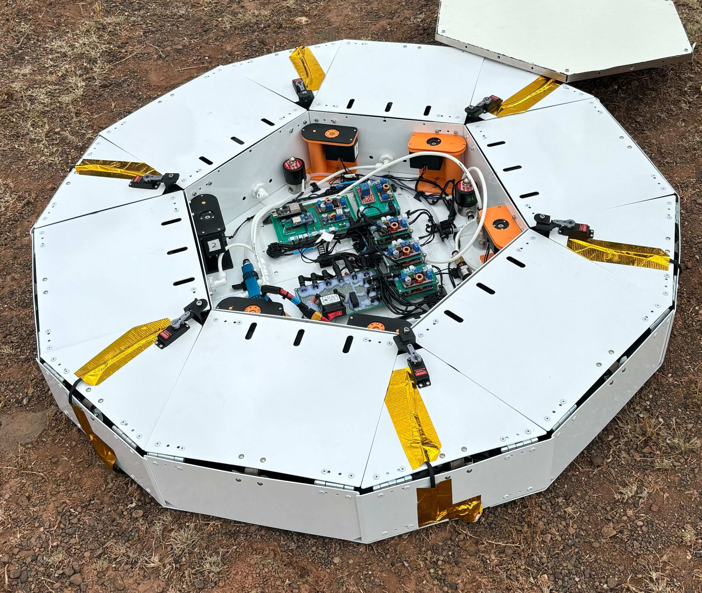
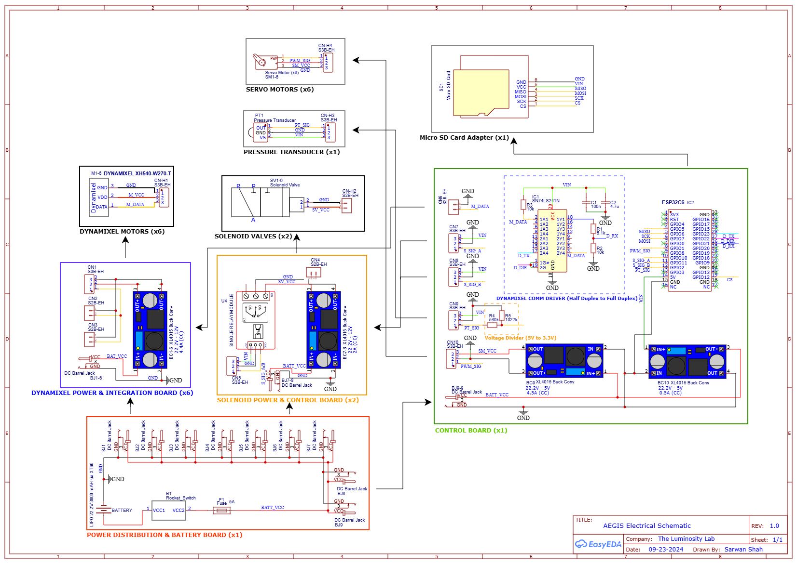

## Summary

Designed a control system for controlling 6 motor, 6 servos, 2 solenoid values using an ESP32C6. The system was able to maintain pressure within +/- 0.25 PSI of the set-point using a Bang-bang control methodology. State-machine routine was developed in software and a web-server as a UI enabled wireless control of the system.

## Overview

Worked as engineering lead on AEGIS - the inflatable lunar landing pad during Fall 2024. The novel system was designed, built, and tested by a multidisciplinary team of students from Arizona State University (at the Luminosity Lab) in response to the 2024 NASA BIG Idea Challenge to provide a low Size Weight and Power (SWaP) solution for reducing regolith ejecta generated by lunar landers. The project won the **Best Systems Engineering Award** at the NASA Big Idea Challenge Forum. 

## Design Highlights

A control system was designed to actuate the inflatable subsystem, anchor subsystem, and
enclosure subsystem while also providing a human-machine interface for deploying each
subsystem for Earth analog testing. The control system used an ESP32C6 as the primary
controller for actuating 6 servo motors (releasing enclosure), 6 continuous servo motors
(driving anchors), and 2 solenoid valves (inflatable system control), while 1 pressure
transducer measures pressure in the inflatable system. The electrical schematic for the
implemented prototype is shown below. 

Additionally, embedded software program on the controller implemented a state machine in which each
state corresponded to a stage of the deployment process: Anchor Deployment, Tarp Deployment,
and Inflation. The inflation state made use of a bang-bang controller to maintain pressure in the
tarp volume by actuating the solenoids and using data from the pressure transducer as
feedback. Moreover, the software also incorporated states that supported the packaging of the
Aegis system such as deflation, tarp locking, and anchor retraction, along with safety states
designed to mitigate risk to Aegis or the lander during operation. Lastly, the software also
implemented a web-server as a user interface (UI) enabling wireless control of the system’s
states.

## Snapshots

